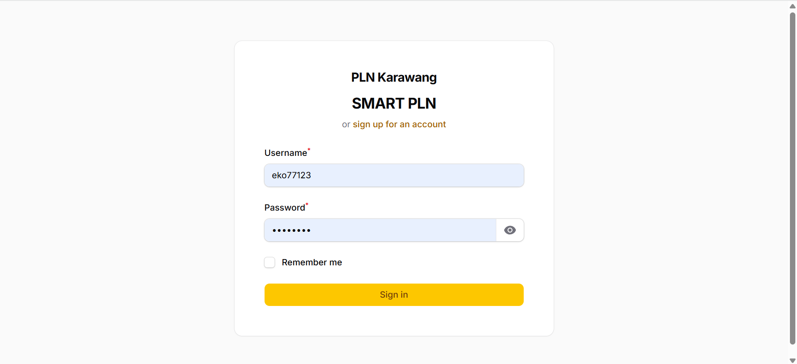

# Aplikasi Pembayaran Listrik Pascabayar

Aplikasi web untuk mengelola dan melakukan pembayaran listrik pascabayar secara online. Sistem ini dirancang untuk mensimulasikan alur pembayaran listrik mulai dari pencatatan penggunaan, penagihan, hingga proses pembayaran dan monitoring status pembayaran.

Project ini dibuat sebagai studi kasus pengembangan aplikasi backend menggunakan Laravel.

---

## Tech Stack

* Backend: Laravel 12
* Database: MySQL
* Authentication: Laravel Auth
* Payment Gateway: Midtrans (Simulation)
* UI Framework: Blade / Filament 5.0 (Admin Panel) 

---

## Features

### Customer / Pelanggan

* Login pelanggan
* Melihat data penggunaan listrik
* Melihat tagihan listrik pascabayar
* Melakukan pembayaran tagihan
* Melihat status pembayaran (Belum Bayar / Lunas)
* Riwayat pembayaran

### Admin

* Manajemen data pelanggan
* Input & monitoring penggunaan listrik
* Generate tagihan listrik bulanan
* Monitoring pembayaran pelanggan
* Validasi dan pengecekan transaksi

---

## Business Flow

1. Admin mencatat penggunaan listrik pelanggan setiap periode
2. Sistem menghasilkan tagihan listrik berdasarkan penggunaan
3. Pelanggan login dan melihat tagihan
4. Pelanggan melakukan pembayaran
5. Sistem memperbarui status tagihan menjadi Lunas setelah pembayaran berhasil

---

## Database Overview

Main tables used in this project:

* pelanggan
* penggunaan
* tagihan
* transaksi
* pembayaran
* user

---

## Screenshots

<p align="center">
  
</p>

---

## Installation & Setup

```bash
git clone https://github.com/wisnuajipamungkas354/listrik_pascabayar.git
cd listrik-pascabayar
composer install
cp .env.example .env
php artisan key:generate
php artisan migrate --seed
php artisan serve
```

---

## What I Learned

* Designing business flow for postpaid payment systems
* Implementing payment workflow and transaction status
* Handling relational database design
* Integrating payment gateway (Midtrans) simulation
* Building admin dashboard using Laravel Filament

---

## Notes

This project is intended for learning purposes and system design practice.
